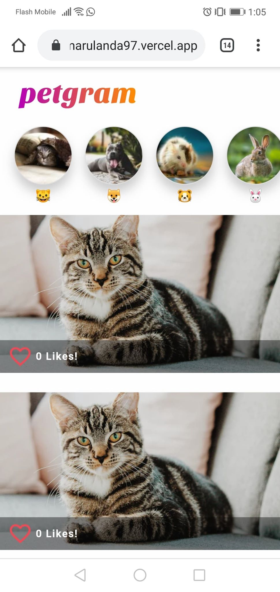

# PETGRAM

This project is my practice of the course "React Avanzado" in Platzi. You can take pieces of this code how reference for your projects.

Feel free to contribute with this project, make corrections and teach your good development practices.

You can see the app in https://petgram.smarulanda97.vercel.app

## IMPORTANT
- You can see the app in https://petgram.smarulanda97.vercel.app
- Required Node.js >= 12

## LIBRARIES

* React
* Standar
* Webpack
* Babel
* Styled Components

## INSTALLATION PROCESS

* `cp .env.example .env` Create env vars file
* `npm install` Install project dependencies
* `npm run dev` Run development server and open http://localhost:8080
* `npm run build`  For build a production build

## LICENCE 

MIT
